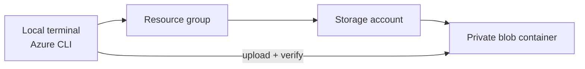

# Azure Lab 01 — Resource Group + Private Blob Storage

[All labs](../README.md) · [Next: Lab 02 →](../02-static-website-storage/README.md)

**Status:** Completed + cleaned up. The manual Azure CLI lab is documented, the resources were deleted, and the result is retained in [cleanup proof](cleanup-proof.md).

This lab establishes the Azure control-plane and storage basics behind later workloads: a resource group, a storage account, a private blob container, and a verified upload path.

## Architecture



## What I implemented

- Created and inspected the resource group with Azure CLI.
- Registered the `Microsoft.Storage` resource provider when the subscription returned `SubscriptionNotFound`.
- Created a Standard_LRS storage account and private blob container.
- Uploaded and listed a test object through Azure CLI.
- Captured screenshots and cleanup evidence.
- Deleted the resource group and verified that it no longer existed.

## Engineering notes

| Decision | Reason |
| --- | --- |
| Resource group as the lab boundary | Makes ownership, lifecycle, and cleanup unambiguous. |
| Private blob container | Avoids treating object storage as public by default. |
| Azure CLI verification | Produces a repeatable record rather than relying only on portal clicks. |
| Resource-provider troubleshooting | Shows how to investigate a control-plane error before changing the design. |
| Delete at resource-group scope | Removes the dependent resources together and controls ongoing cost. |

## Validation evidence

- A test upload is stored in [test-upload.txt](test-upload.txt).
- Screenshots are kept under `screenshots/`.
- Cleanup was verified with:

```bash
az group exists --name rg-azure-hands-on-01
# false
```

## 30-second interview story

> I created a private Blob Storage baseline with Azure CLI, not just through the portal. When the storage deployment returned a provider-related error, I registered the required resource provider, repeated the deployment, and documented the fix. I then verified a private container upload and deleted the full resource group, with evidence that the lab was cleaned up.

## Cost and cleanup

The lab is intentionally short-lived. Recreate it only for validation, then remove the resource group:

```bash
az group delete --name rg-azure-hands-on-01 --yes --no-wait
```
