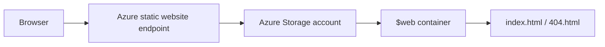

# Azure Lab 02 — Static Website on Azure Storage

**Status:** Completed learning lab with source, verification commands, and cleanup evidence retained in the repository.

This project delivers a simple static site from Azure Storage static website hosting. It is the Azure counterpart to a private-S3-plus-CDN exercise, with the important difference that the Azure Storage static website endpoint is public by design.

## Architecture

## What is included

- Static site source in [site/](site/) with `index.html` and `404.html`.
- Azure Storage static website hosting and the special `$web` container.
- Azure CLI deployment/verification notes in [verification/commands.md](verification/commands.md).
- Cleanup evidence in [verification/cleanup-proof.md](verification/cleanup-proof.md).

## Engineering decisions

| Decision | Why it matters |
| --- | --- |
| Storage static website hosting | A low-operations option for a frontend with no server-side runtime. |
| Separate `index.html` and `404.html` | Makes the entry and error behaviour explicit. |
| CLI verification and cleanup record | Keeps the manual deployment reproducible and cost-aware. |
| Public endpoint called out explicitly | Prevents confusing static website hosting with a private origin/CDN design. |

## Validation checklist

1. Enable static website hosting on the Storage account.
2. Upload the site files to the `$web` container.
3. Open the published endpoint and verify the index page.
4. Request an invalid path and confirm the error document response.
5. Run the commands in [verification/commands.md](verification/commands.md).
6. Delete the resource group when the test is complete.

## Production path

For a production public site I would first clarify whether this endpoint is sufficient. If I need custom DNS, managed TLS, stronger edge controls, private origin access, or Web Application Firewall protection, I would place an appropriate Azure edge service in front and document the release/rollback path.

## 30-second interview story

> I chose Azure Storage static website hosting for a simple frontend because it avoids operating a web server. I kept the source, CLI verification commands, and cleanup evidence together so the lab is reproducible. I also called out the security boundary: the static website endpoint is public, so a production design needing a private origin or edge controls would use a different front-door pattern.

## Cost and cleanup

This is a short-lived lab. The verification folder records the cleanup command and expected result; do not leave the resource group running after validation.