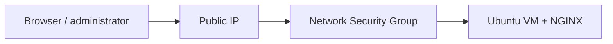

# Azure Lab 03 — Linux VM Web Server Feasibility Assessment

**Status:** Paused before deployment. No virtual machine was created.

This is a documented cost-and-capacity decision, not a falsely completed VM lab. The goal was to deploy a small Ubuntu VM, connect with SSH, install NGINX, and validate HTTP access. The subscription and regional SKU constraints made the intended low-cost VM unavailable, so I investigated and stopped rather than deploying a more expensive alternative.

## Intended architecture



## What I investigated

- Azure Portal VM creation in North Europe.
- Small VM options, especially `Standard_B1s`.
- Subscription and regional SKU availability.
- vCPU quota and quota-adjustment eligibility.
- Required resource providers: `Microsoft.Compute`, `Microsoft.Network`, and `Microsoft.Quota`.
- SSH public-key and Network Security Group configuration for the intended design.

## Outcome and decision

The intended `Standard_B1s` size was shown as `NotAvailableForSubscription` in North Europe. The subscription was not eligible for quota adjustment. I registered the relevant providers and confirmed that the limitation remained.

| Option | Decision | Reason |
| --- | --- | --- |
| Use a larger available VM | Rejected | It would undermine the lab’s cost guardrail. |
| Request more quota | Not available | The subscription did not permit a quota adjustment. |
| Continue without a VM | Chosen | It avoids unnecessary spend and documents the constraint clearly. |

## Why this is still useful evidence

Cloud engineering includes knowing when **not** to deploy. I separated the deployment blocker from the intended architecture, investigated provider/quota state, recorded the evidence, and left no VM running. That is a more credible operational decision than forcing an uneconomical resource into a portfolio lab.

## If resumed

1. Choose a subscription/region where a cost-safe VM SKU is available.
2. Create an Ubuntu VM with SSH public-key authentication.
3. Limit Network Security Group ingress to SSH from an administrator IP and HTTP only as required.
4. Install NGINX, validate the site, and collect logs and screenshots.
5. Delete the full resource group and record the result.

## 30-second interview story

> I planned a basic Linux web-server lab, but the small VM SKU was not available for my subscription and region. I checked providers, quotas, and alternate SKUs. Because the alternative would have increased cost for a learning exercise, I paused the deployment, documented the actual constraint, and made sure no VM resources were left behind. That reinforced that cloud work is cost- and constraint-aware, not just about provisioning services.

## Cleanup

No VM was deployed. If the lab resource group exists during a future retry, remove it after validation:

```bash
az group delete --name rg-rce-03-linux-vm-web-server --yes --no-wait
```