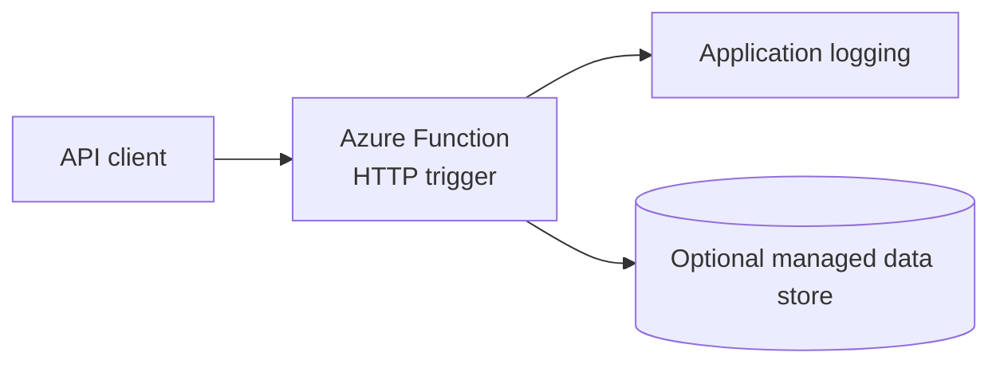

# Azure Lab 04 — Serverless Function API

**Status:** Planned lab scaffold. No Azure resources are represented as deployed yet.

Build a small HTTP API with Azure Functions to demonstrate serverless execution, request validation, configuration, logging, and a clean deployment contract.

## Target architecture



## Scope

- A Python HTTP-triggered Function with a `/health` endpoint and one small business endpoint.
- Configuration through application settings; no secrets in source control.
- Structured logs and a concise error contract.
- Infrastructure definition in Terraform or Bicep.
- A repeatable local test and a short deployment validation.

## Evidence required before this becomes featured

1. Source and dependency definitions.
2. A request example and successful response capture.
3. A failed-input example and the expected error response.
4. Logs that show the request can be diagnosed.
5. Deployment and cleanup commands.
6. A short trade-off note: Functions versus Container Apps or a VM.

## Cost guardrail

Start with the smallest appropriate Functions hosting option and a minimal Storage account. Keep observability retention short, remove the Function App and its dependent resources after validation, and do not leave a test endpoint active without a reason.

## Suggested implementation layout

```text
src/        # function source
infra/       # Terraform or Bicep
tests/       # local/HTTP tests
evidence/    # screenshots and response captures
runbook.md   # deploy, validate, rollback, cleanup
```

## Interview prompt

> I selected a Function for a small HTTP workload because the operational focus is request handling and observability rather than maintaining a server. Before treating it as a finished lab, I need evidence for input validation, logging, configuration, deployment, and cleanup.