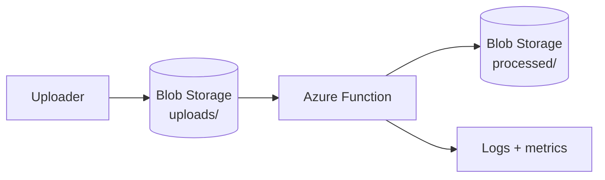

# Azure Lab 05 — Event-Driven Blob Processing

[← Previous: Lab 04](../04-serverless-function-api/README.md) · [All labs](../README.md) · [Next: Lab 06 →](../06-container-app-deployment/README.md)

**Status:** Planned scaffold. No Azure resources are represented as deployed.

Build an asynchronous file-processing path where a blob upload triggers a function and the result is written to a separate location. The lab is designed to demonstrate event filtering, retry thinking, idempotency, and operational evidence.

## Target architecture



## Scope

- Input and processed Blob Storage paths that prevent accidental trigger loops.
- A blob-triggered Azure Function with explicit input validation.
- A deterministic processed output and clear error handling.
- Terraform or Bicep for the storage/function resources.
- Logs, metrics, and a short failure/retry narrative.

## Evidence required before this becomes featured

1. Upload a known test file and capture the resulting output.
2. Show that an unsupported file does not take the normal processing path.
3. Capture logs for success and a controlled failure.
4. Document how duplicate event delivery is handled safely.
5. Add a cleanup record for the Function App, Storage account, and monitoring resources.

## Cost guardrail

Keep test files small, retention short, and the environment time-boxed. Delete the resource group after validation; storage, function hosting, and monitoring can otherwise accumulate cost.

## Suggested implementation layout

```text
src/        # event handler
infra/       # Terraform or Bicep
fixtures/    # safe test inputs
evidence/    # logs and output proof
runbook.md   # replay, failure, cleanup
```

## Interview prompt

> I use an event-driven design so the processor runs when a file arrives instead of maintaining a server or polling storage. The critical production questions are event filtering, idempotency, retries, and visibility into failed processing.
