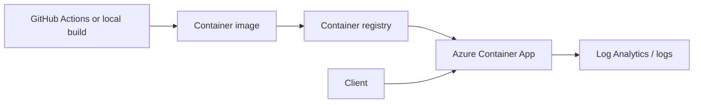

# Azure Lab 06 — Container App Deployment

[← Previous: Lab 05](../05-event-driven-blob-processing/README.md) · [All labs](../README.md) · [Next: Lab 07 →](../07-monitoring-and-alerts/README.md)

**Status:** Planned scaffold. No Azure resources are represented as deployed.

Deploy a small containerised service to Azure Container Apps. This is the Azure counterpart to an ECS/Fargate-style application exercise: image build, runtime configuration, health checks, logs, revision management, and cleanup.

## Target architecture



## Scope

- A minimal container image with a health endpoint.
- Non-secret configuration through the platform’s configuration mechanism.
- One Container App revision with logs and a documented rollout/rollback path.
- Terraform or Bicep for the environment and application.
- A decision record comparing Container Apps with Functions and AKS for this workload.

## Evidence required before this becomes featured

1. Reproducible Docker build instructions.
2. A deployed revision and a successful health check.
3. Runtime logs associated with the deployment.
4. A rollback test or a clearly documented rollback procedure.
5. Cleanup proof for the Container App environment, registry/image artifacts, and logs.

## Cost guardrail

Use a small workload and stop/remove it immediately after validation. Container environments, registries, and log retention can create cost, so the runbook must include an explicit teardown order.

## Suggested implementation layout

```text
app/        # small service
infra/      # Terraform or Bicep
.github/    # CI build and validation
evidence/   # build, deploy, health-check proof
runbook.md  # release, rollback, cleanup
```

## Interview prompt

> I would choose Container Apps when I want to run a containerised service without taking on the operational surface of Kubernetes. I would validate the image, health endpoint, logs, revision behaviour, and teardown before calling it complete.
