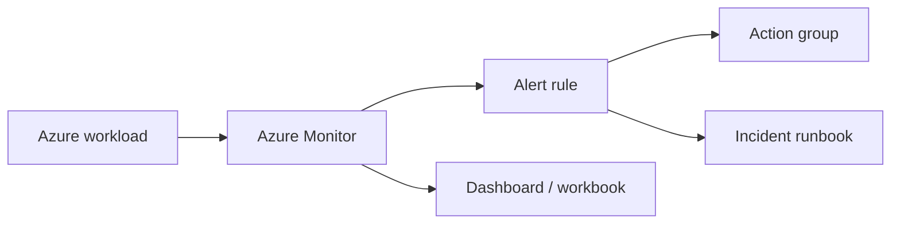

# Azure Lab 07 — Monitoring and Alerts

**Status:** Planned lab scaffold. No Azure resources are represented as deployed yet.

Turn a small Azure workload into an operable service by defining signals, dashboards, alerts, and an incident runbook. The aim is to show judgment: alerts should be actionable, not just numerous.

## Target architecture



## Scope

- Choose one existing workload and identify availability, error, latency, and saturation signals.
- Create a small dashboard/workbook focused on an operator’s first five minutes.
- Define one actionable alert with an owner, severity, threshold, and response.
- Trigger a controlled test condition and capture the alert lifecycle.
- Write a short incident runbook and cleanup plan.

## Evidence required before this becomes featured

1. Signal-to-alert mapping with the reason each threshold was chosen.
2. Dashboard/workbook screenshot or exported configuration.
3. A controlled alert test and the alert resolution.
4. Runbook steps covering triage, mitigation, and escalation.
5. Retention and cost choices documented.

## Cost guardrail

Start with a single workload, few signals, and a short Log Analytics retention period. Remove action groups, alert rules, and monitoring resources after the controlled test when they are no longer needed.

## Suggested implementation layout

```text
alerts/       # alert definitions
dashboards/   # workbook/dashboard configuration
evidence/     # test alert proof
runbook.md    # triage and recovery steps
cost-notes.md # retention and cleanup choices
```

## Interview prompt

> I design alerts from an operator’s response, not from a service list. Every alert should name the affected user outcome, the owner, the first investigation step, and the expected mitigation.