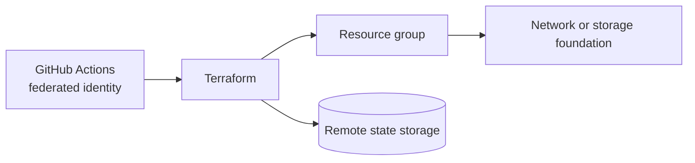

# Azure Lab 08 — Terraform Azure Foundation

**Status:** Planned lab scaffold. No Azure resources are represented as deployed yet.

Build a small, provider-appropriate Terraform foundation for Azure. The focus is repeatable environments, state handling, identity, validation, and safe cleanup — not creating a large always-on platform.

## Target architecture



## Scope

- A clean module/environment layout, beginning with a resource group and a low-cost foundational resource.
- Remote Terraform state with an explicit locking/access approach suitable for the selected backend.
- Non-secret authentication for CI where feasible, using federated identity rather than long-lived credentials.
- `terraform fmt`, `validate`, and plan review in CI.
- A separate developer/test environment only when there is a real configuration difference to demonstrate.

## Evidence required before this becomes featured

1. Repository structure and dependency versions.
2. Remote state and access rationale.
3. CI validation output for format, validate, and plan.
4. A small apply/verify/destroy cycle.
5. An explanation of why the Azure design differs from the AWS Terraform repository where it should.

## Cost guardrail

Begin with a resource group and low-cost storage. Avoid keeping virtual networks, public IPs, managed databases, or premium monitoring components alive merely to make the repository look larger.

## Suggested implementation layout

```text
modules/           # reusable Terraform units
environments/dev/  # small development configuration
bootstrap/         # state backend setup
.github/workflows/ # fmt, validate, plan checks
docs/              # architecture and state decisions
```

## Interview prompt

> The valuable part of a Terraform foundation is not the number of resources. It is the repeatability, state ownership, identity model, review controls, and disciplined destroy path.